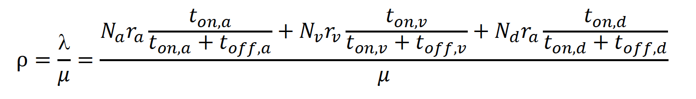

### question a:

Configure the queue as a single FIFO with a very large capacity (K = ∞). Conduct simulations for various offered loads
from 0.1 to 0.9 in steps of 0.1. Compare the average statistics with the theoretical averages. If the simulation results
deviate from the theoretical averages, provide an explanation.

<strong>offered load: a measurement of traffic backlog in the Q</strong>



Here we provide 9 config files.

Given:

```toml
[[source.flows]]
type = "AUDIO"
streams = 2 # number of flows
mean_on_time = 0.36
mean_off_time = 0.64
peak_bit_rate = 64 # kbps
packet_size = 120
[[source.flows]]
type = "VIDEO"
streams = 1 # number of flows
mean_on_time = 0.33
mean_off_time = 0.73
peak_bit_rate = 384 # kbps
packet_size = 1000
[[source.flows]]
type = "DATA"
streams = 1 # number of flows
mean_on_time = 0.35
mean_off_time = 0.65
peak_bit_rate = 256 # kbps
packet_size = 583
```

If the above parameters are fixed, the server_rate can be calculated for the requirement.
λ = 255227.156250
μ = λ / ρ
For ρ = 0.1, μ = 2552k
For ρ = 0.2, μ = 1276k
For ρ = 0.3, μ = 850k
For ρ = 0.4, μ = 638k
For ρ = 0.5, μ = 510k
For ρ = 0.6, μ = 425k
For ρ = 0.7, μ = 364k
For ρ = 0.8, μ = 319k
For ρ = 0.8, μ = 283k


